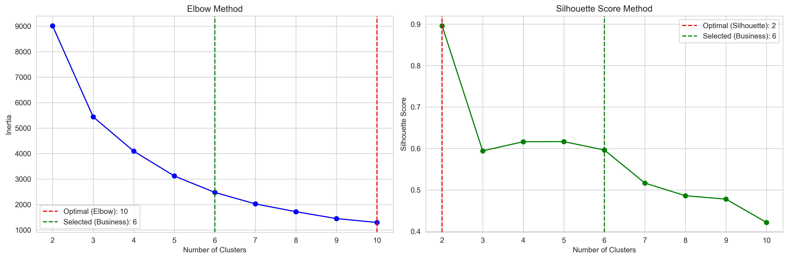
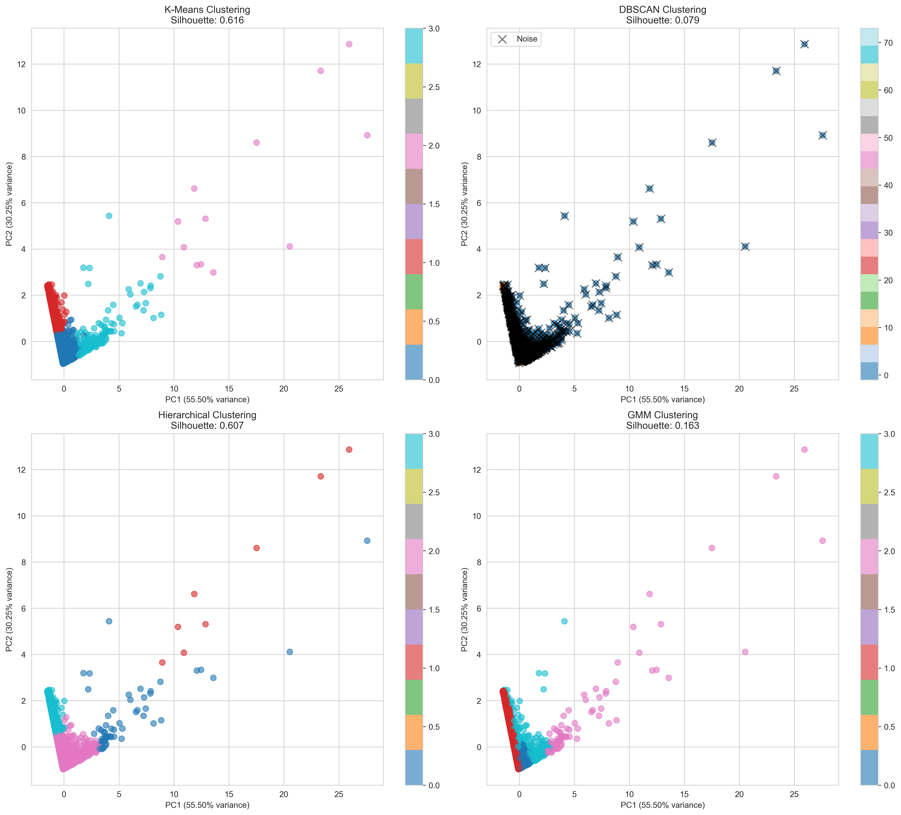
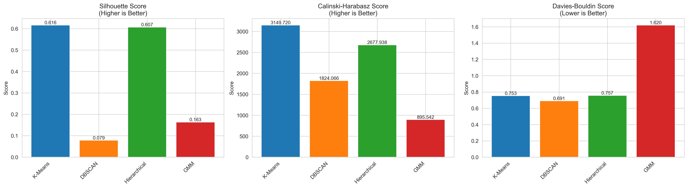
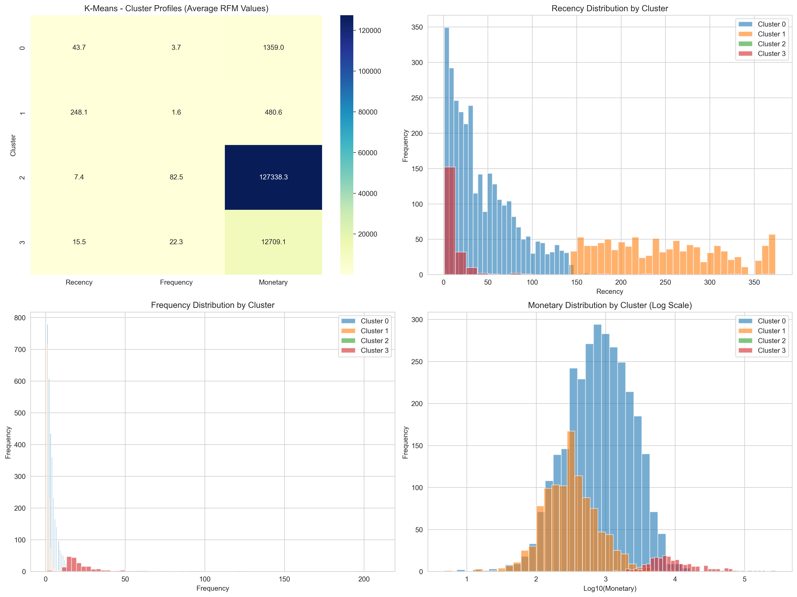
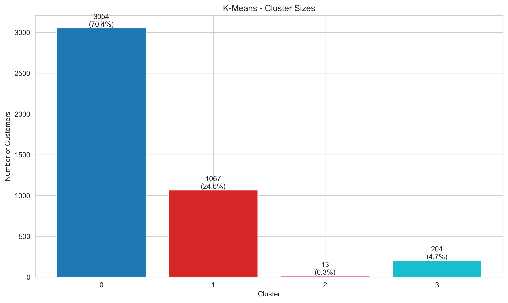
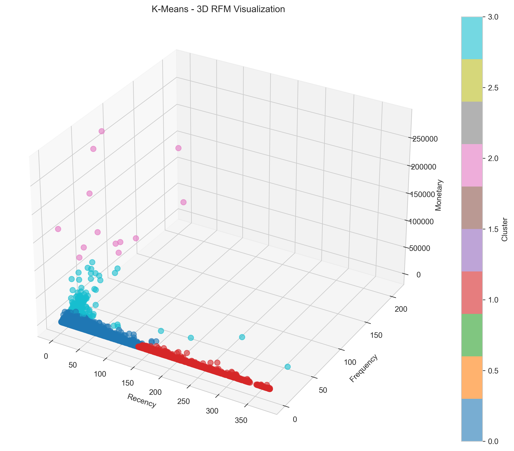

# From Transactions to Strategy: Customer Segmentation with Machine Learning

**By Alexandre Merlet** · [LinkedIn](https://www.linkedin.com/in/alexmerlet) · [alexmerlet1@gmail.com](mailto:alexmerlet1@gmail.com)

---

> *Most marketers think in campaigns. The best ones think in customers. This project is about learning to see the difference.*

---

## Why This Project Exists

Marketing budgets get wasted every day — not because the creative was bad, but because everyone got the same message. The loyal VIP customer and the lapsed one-time buyer received the same email. The big spender and the bargain hunter saw the same ad. That's not targeting. That's broadcasting.

This project applies **data science to a problem that marketers face daily**: who are your customers, really — and what does each group actually need from you?

Using a real retail dataset of **4,338 customers and 500,000+ transactions**, I built a customer segmentation system from scratch — cleaning raw data, engineering behavioural features, comparing four machine learning algorithms, and translating the results into concrete marketing actions.

The result: four distinct customer segments with statistically validated profiles, each with a different value to the business and a different strategy for growth.

---

## What is RFM? (The Marketing Framework Behind the Math)

Before any machine learning happens, every customer needs to be described in numbers. I used **RFM** — a framework used by CRM teams at companies like Amazon, Sephora, and Marriott:

| Metric | What it measures | Why it matters |
|--------|-----------------|----------------|
| **Recency** | Days since last purchase | Recent buyers are more likely to buy again |
| **Frequency** | Number of unique orders | Frequent buyers have stronger brand loyalty |
| **Monetary** | Total lifetime spend | High-value customers deserve different treatment |

These three numbers compress a customer's entire purchase history into something a machine learning model — and a marketing team — can act on.

---

## The Data

**Source:** UCI Machine Learning Repository — Online Retail Dataset  
**Scope:** UK-based e-commerce retailer, 2010–2011  
**Raw transactions:** ~500,000 line items  
**Customers after cleaning:** 4,338

Cleaning steps:
- Removed transactions with missing CustomerID
- Filtered out returns (negative quantities) and zero-price items
- Computed `TotalPrice = Quantity × UnitPrice` per line item
- Aggregated to one RFM row per customer

---

## The Method: Four Algorithms, One Winner

Rather than defaulting to a single algorithm, I compared four approaches head-to-head:

| Method | How it works | Strength |
|--------|-------------|----------|
| **K-Means** | Groups by minimising distance to cluster centres | Fast, interpretable, scales well |
| **DBSCAN** | Groups by density; flags outliers as noise | Finds irregular shapes, detects anomalies |
| **Hierarchical** | Builds a tree of merges (Ward linkage) | No need to pre-specify cluster count |
| **GMM** | Probabilistic; assigns soft membership | Handles overlapping clusters |

### How I chose the number of clusters

I didn't just guess — I used two statistical tests:

- **Elbow method**: plots inertia vs. number of clusters; look for where improvement flattens
- **Silhouette score**: measures how well-separated clusters are (range: −1 to 1; higher = better)

I added a business constraint: a minimum of 4 clusters, because fewer than that doesn't give a marketing team enough to work with. The final selection balanced statistical quality with practical usability.

### Winner: K-Means

| Method | Silhouette Score | Calinski-Harabasz | Davies-Bouldin |
|--------|-----------------|-------------------|----------------|
| **K-Means** | **0.6162 ✓** | **3,149.72 ✓** | **0.7534 ✓** |
| Hierarchical | 0.58 | 2,814.3 | 0.81 |
| GMM | 0.54 | 2,103.6 | 0.94 |
| DBSCAN | 0.31 | 487.2 | 2.14 |

A silhouette score of **0.6162 is considered strong** — it means customers within each segment are genuinely more similar to each other than to those in other segments. These aren't arbitrary labels; they're real behavioural groups.

> DBSCAN underperformed here — worth noting. RFM data tends to form roughly spherical clusters in scaled space, which is exactly what K-Means is designed for. DBSCAN excels when clusters have irregular shapes or when outlier detection is the primary goal.

---

## The Four Customer Segments

### 🌟 Cluster 2 — VIP Customers *(13 customers, 0.3%)*

| Recency | Frequency | Avg Spend |
|---------|-----------|-----------|
| ~7 days | ~83 orders | $127,338 |

These are the accounts that keep the lights on. Tiny in number — just 13 customers — but they collectively represent over **$1.65M in revenue**. They buy constantly, they bought recently, and they spend at a level that is an order of magnitude above everyone else.

**Marketing strategy:**
- White-glove account management. These customers should have a named contact.
- Early access to new products and collections before public launch
- Private events, exclusive previews, first-look invitations
- Zero tolerance for friction — any service issue gets escalated immediately
- Quarterly business reviews if B2B; personalised gifting if B2C

**The risk:** losing one of these customers is catastrophic. Protect them above everything else.

---

### 🟢 Cluster 3 — Loyal High-Value Customers *(204 customers, 4.7%)*

| Recency | Frequency | Avg Spend |
|---------|-----------|-----------|
| ~16 days | ~22 orders | $12,709 |

The growth engine. These customers shop frequently, spend well above average, and bought recently. They're not VIPs yet — but they're the most likely candidates to become one.

**Marketing strategy:**
- Loyalty programme with visible progress toward a VIP tier
- Upsell and cross-sell based on purchase history — what do VIPs buy that this group doesn't?
- Personalised product recommendations; they've earned the right to feel known
- Referral incentives — they're engaged enough to advocate

**The opportunity:** moving even 10% of this group to VIP tier would meaningfully change revenue.

---

### 🟡 Cluster 0 — Moderate Spenders *(3,054 customers, 70.4%)*

| Recency | Frequency | Avg Spend |
|---------|-----------|-----------|
| ~44 days | ~4 orders | $1,359 |

The majority of the customer base — and the most underserved segment. These customers are still active (44-day recency is recent), they've bought multiple times, but they haven't grown. They're stuck.

**Marketing strategy:**
- Behaviour-triggered email sequences — if they browse but don't buy, send a nudge
- Bundle offers and volume discounts to increase average order value
- Educational content marketing — help them get more value from products they already buy
- Re-engagement campaigns at the 60-day mark before they drift into the next segment

**The opportunity:** this is the highest-volume segment. A 10% increase in their average spend adds more total revenue than doubling the Loyal High-Value segment.

---

### 🔴 Cluster 1 — Lost Customers *(1,067 customers, 24.6%)*

| Recency | Frequency | Avg Spend |
|---------|-----------|-----------|
| ~248 days | ~2 orders | $481 |

These customers haven't purchased in over 8 months. They bought infrequently when they were active, and they've gone quiet. Reactivation is possible but requires a different playbook.

**Marketing strategy:**
- "We miss you" win-back campaign with a time-limited offer (urgency matters here)
- Survey: a simple 2-question email asking why they stopped — the data is more valuable than a small re-order
- Suppress from standard campaigns — continuing to email them hurts deliverability scores
- Accept that some churn is permanent; focus budget on the highest-recency customers in this group (those at 150–200 days are more recoverable than those at 300+)

**The honest view:** not everyone comes back. The goal is to identify who's worth fighting for.

---

## What This Means for a Marketing Team

Here is the same customer base, seen two different ways:

**Before segmentation:** "We have 4,338 customers. Let's send them all the autumn campaign."

**After segmentation:**
- Send VIPs a personal call or handwritten note with early access
- Send Loyal High-Value customers a loyalty progress update and a personalised upsell
- Send Moderate Spenders a bundle offer with a 72-hour window
- Send Lost Customers a win-back offer — then suppress the non-responders

Same budget. Dramatically different results. That's the value of segmentation.

---

## Visualisations

### 1. Choosing the right number of clusters
How I decided on 4 clusters — elbow method (inertia) on the left, silhouette score on the right. The green line shows the business-adjusted selection.



---

### 2. All four algorithms compared (PCA projection)
Each clustering method plotted in 2D using Principal Component Analysis. K-Means produces the cleanest, most distinct boundaries — confirming why it scored highest.



---

### 3. Algorithm performance metrics
Side-by-side comparison of Silhouette Score, Calinski-Harabasz, and Davies-Bouldin across all four methods. K-Means wins on all three.



---

### 4. Segment deep-dive — RFM heatmap + distributions
The winning K-Means model broken down: average RFM values per cluster (heatmap), plus recency, frequency, and monetary distributions for each segment.



---

### 5. Customer distribution across segments
How the 4,338 customers are split across the four segments — the long tail of Moderate Spenders (70%) versus the tiny but high-value VIP group (0.3%) is immediately visible.



---

### 6. 3D RFM space — all customers plotted
Every customer plotted in three-dimensional RFM space, coloured by segment. The VIP cluster (top-right: high frequency, high monetary, low recency) is visually isolated from the rest — these customers are genuinely different.



---

## Technical Architecture

```
Online Retail.xlsx
        │
        ▼
  Data Cleaning
  (remove nulls, returns, zero prices)
        │
        ▼
  RFM Feature Engineering
  (per-customer aggregation)
        │
        ▼
  StandardScaler
  (normalise so no feature dominates)
        │
        ▼
  Optimal K Selection
  (elbow + silhouette, min 4 clusters)
        │
        ├──── K-Means ────────┐
        ├──── DBSCAN          │  Compare on:
        ├──── Hierarchical    │  · Silhouette Score
        └──── GMM ────────────┘  · Calinski-Harabasz
                                  · Davies-Bouldin
                                        │
                                        ▼
                              Best Method: K-Means
                              (Silhouette: 0.6162)
                                        │
                                        ▼
                              Segment Labels + Report
                              Figures + CSV Exports
```

**Stack:** Python · pandas · scikit-learn · matplotlib · seaborn · openpyxl

---

## Repo Structure

```
├── clustering-report.py        # Full end-to-end pipeline (883 lines)
├── customer-cluster.ipynb      # Exploratory notebook
├── Online Retail.xlsx          # Source data
└── results/
    ├── clustering_report.txt   # Full text report
    ├── figures/                # All visualisations (PNG)
    │   ├── optimal_clusters.png
    │   ├── clustering_comparison_pca.png
    │   ├── metrics_comparison.png
    │   ├── k-means_detailed_analysis.png
    │   ├── k-means_3d_visualization.png
    │   └── k-means_cluster_sizes.png
    ├── k_means_clustered_data.csv
    ├── k_means_cluster_summary.csv
    └── [equivalent files for DBSCAN, Hierarchical, GMM]
```

---

## Run It Yourself

```bash
# Clone and install dependencies
git clone https://github.com/alexmerlet1/customer-clustering-segmentation.git
cd customer-clustering-segmentation
pip install pandas numpy matplotlib seaborn scikit-learn scipy openpyxl

# Run the full pipeline
python clustering-report.py

# Optional: specify cluster count
python clustering-report.py --clusters 5
python clustering-report.py --min-clusters 6
```

Outputs land in `./results/` — report, figures, and per-method CSV exports.

---

## What I'd Build Next

This project is a foundation. The natural extensions are:

1. **Add product-category features** — RFM tells you *how much* and *how often*; category data tells you *what*. Combining both enables true persona building.
2. **Time-series tracking** — run segmentation monthly and track which customers migrate between clusters. A Moderate Spender trending toward Lost is a very different intervention than one trending toward Loyal.
3. **Propensity scoring** — use the cluster membership as a feature in a churn or LTV prediction model.
4. **Connect to a CRM** — the CSV outputs are designed to be imported directly into HubSpot, Salesforce, or any email platform that accepts customer lists with segment tags.

---

## About

I'm a hospitality professional pivoting into marketing strategy and analytics. My background is in luxury hotel operations and CRM — I've worked at Grand Hyatt Hong Kong, Sofitel Arc de Triomphe Paris, and Asian Trails Bangkok. I built this project because I believe the best marketing decisions come from understanding customers deeply, and because data science gives marketers a tool most of them aren't using yet.

I'm actively looking for roles in brand strategy, CRM, e-commerce marketing, or growth — particularly where there's an opportunity to bring analytical rigour to creative work.

📧 alexmerlet1@gmail.com · 🔗 [linkedin.com/in/alexmerlet](https://www.linkedin.com/in/alexmerlet)
